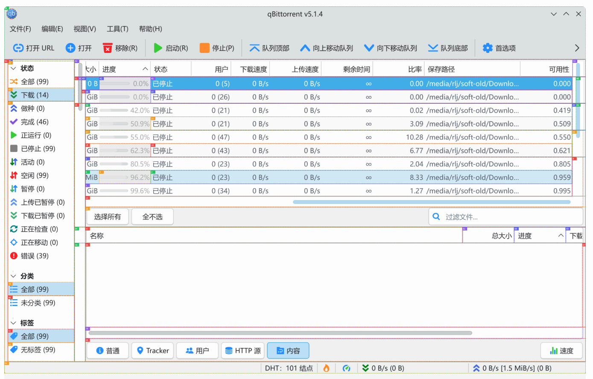

文本是用 Claude Sonnet/Opus 4.6 开发 “UI 区域检测”功能的过程记录，文章大部分内容为 llm 生成。

因为要做些 ui 自动化的功能，涉及到区域检测。这个功能大概用了 5h+，本文主要记录整个迭代演进过程，以及 llm 对这个过程的评价。
<!--more-->
基于 opencv 实现的最终效果，总体效果堪称完美。
 <!-- original:  -->

## 迭代回顾
以下是 Claude Sonnet/Opus 4.6 对所有 vibe coding 会话内容的总结

### 时间线

#### 阶段一：基础搭建与通用 CV 方法（v1-v5）

1. **Spec 执行 + 初始实现** — 执行 image-region-detection spec 全部 6 个任务。Pydantic 模型、路由、服务层（Canny + findContours）、测试一次通过。

2. **前端叠加层** — ScreenshotViewer 加"检测区域"按钮，SVG overlay + viewBox 叠加区域框，支持显示/隐藏。

3. **算法 v1→v2：Canny→Sobel+形态学** — 识别出太多小区域。换成大核高斯模糊 + Sobel + 形态学 close + NMS，前端 min_area 改 8000。

4. **min_area 自适应** — 8000 硬编码不合理，改为 min_area=0 时自动计算为图像面积 0.5%。

5. **算法 v3：投影法** — 水平投影行分割 → 行内垂直投影列分割。纯白图像 Otsu 退化通过 gray.std() < 2.0 前置检查解决。

6. **投影法调参** — 太碎，空白阈值 2%→5%，min_gap 3→8，最小块 5px→20px。

7. **算法 v4：投影+颜色突变** — 顶部菜单条内容密集投影无法分割，加相邻行均值突变检测。

8. **全局垂直分割** — 垂直投影在 band 内信号被稀释，加全图垂直投影 + 列颜色突变。

9. **颜色突变阈值调高** — percentile 92→98，min_gap 3→6。本质问题不变：无法区分文字边界和结构边界。

10. **算法 v5：形态学线提取** — Canny 边缘 → 长核 close+open 提取 H/V 线 → 线位置构成网格 → 网格单元即区域。只检测真实 UI 边框线。

#### 阶段二：OCR 方案探索（v6）

11. **OCR 方案试探** — 用 PP-OCRv5 的 rec_boxes 直接作为区域输出。文本定位准确但全是零散小框，缺乏层级。

12. **OCR + 层次聚类** — 欧氏距离多级聚类（15/50/120px）构建层级树。聚合块不符合 UI 布局逻辑，效果差。

13. **OCR + 行列聚类** — 先按 Y 聚行（重叠或间距<5px），行内按 X 聚组（间距<20px），相邻行合并面板。仍不理想，放弃 OCR，回退 CV。

#### 阶段三：蛋糕切割算法（v7，最终方案）

14. **蛋糕切割（初版）** — 用户提出核心思路：像切蛋糕一样找贯通线切割。初版一次性找所有线全部切开（本质还是网格），ratio=0.40 太低导致文字区域误判。

15. **形态学过滤尝试** — 用 morphological close+open 先提取连续线结构再判断贯通。反而把文字边缘连成更多假线，效果更差，回退。

16. **ratio 0.40→0.60** — 回到像素计数，提高阈值。仍有少量误判。

17. **ratio 0.60→0.90** — 接近真正的"贯通"定义，误判大幅减少。

18. **真正的蛋糕切割** — 改为每次只找第一条线切一刀分两块递归。准确率高但漏检——切完一刀后同方向其他线被跳过。

19. **同方向全切 + 交替递归** — 同方向找到所有贯通线一次切成条，每条用另一方向递归。逻辑正确，但部分浅灰色线未被检测到。

20. **Canny 阈值诊断** — 写脚本分析 region 13，发现浅灰色分界线（灰度 231→255）在 Canny(30,100) 下完全无响应，Canny(20,60) 可检测到 96% 覆盖率。

21. **最终方案** — Canny(20,60) + 90% 贯通率 + 交替横纵递归切割。前端 SVG 改为嵌套 `<g>` 按层级组织 DOM，加"复制JSON"按钮便于调试。

#### 阶段四：对比度增强与自适应阈值（v8）

22. **对比度增强调研（screen.png）** — 用户提出通过调整对比度提升识别效果。对 screen.png 跑诊断脚本，测试 CLAHE / 直方图均衡化 / 线性拉伸三种方法。结论：该图 90% 像素在 224-255 区间，对比度不是瓶颈，三种方法检测到的线完全一致。

23. **对比度增强调研（image.png）** — 同样方法分析 image.png。发现 CLAHE 多检测到 1 条线 y=42（标题栏/菜单栏分隔线，灰度 240 vs 255，梯度仅 15）。原始 Canny 在该行覆盖率为 0，CLAHE 将微弱梯度放大后相邻行达到 97-100% 覆盖率。主内容区（mean=254.9, std=3.4）无改善——几乎纯白，无结构线可增强。

24. **加入 CLAHE 预处理** — 在 Canny 之前加 `CLAHE(clipLimit=2.0, tileGridSize=(8,8))`。image.png 从 33 个区域增至 34 个，新增 y=42 分界线。screen.png 从原有区域增至 71 个，菜单栏内部被进一步切割。代价极小（一次 CLAHE 运算），无误判。

25. **自适应 ratio 诊断（image2.png）** — 区域 32（x=501, y=130, w=1419, h=55）内部应有横线但未被切割。诊断发现 y=132 和 y=158 两条真实分界线（灰度 231 横线）在子区域内覆盖率 87%，差 90% 阈值 3 个百分点。缺口原因：线在局部被 UI 元素打断（按钮/标签背景色与线颜色相同），不是对比度问题。

26. **自适应 ratio** — 随递归深度降低 ratio：`max(0.82, 0.90 - depth * 0.02)`。顶层严格（0.90）避免误判，深层宽容（最低 0.82）捕获被局部元素打断的线。image2.png 从 71 个区域增至 80 个，原区域 32 被正确切成标签行（y=131, h=27）和工具栏行（y=158, h=27）。三张测试图均无误判。

#### 阶段五：长度自适应 ratio 与间隙检查（v9）

27. **ratio 方向修正** — 用户指出深度递减 ratio 方向错误：浅层区域大、不易误判应宽松，深层区域小、易误判应严格。但深度不是好的代理变量——同一深度的区域尺度可能差异很大。

28. **改为长度自适应 ratio** — ratio 根据线的垂直方向长度（即线所跨越的像素数）缩放：≤100px→0.95（严格），≥1000px→0.85（宽松），中间线性插值。短线更容易因文字碎片凑出高覆盖率，需要更严格；长线绝对像素数多，可以更宽容。`_find_dividing_lines` 不再接受外部 ratio 参数，内部根据 length 自行计算。

29. **间隙检查（image5.png）** — y=174 在全宽 1920px 下覆盖率 92%，通过 ratio 阈值。但右半部分 99.8%、左半部分仅 69.4%（文字碎片拼凑，非真实线）。加入最大间隙检查：`max_gap_allowed = int(length * 0.15)`，检查前导间隙、尾部间隙和最大内部间隙（`np.diff(np.where(line > 0)[0])`）。任何间隙超过线长 15% 的候选线被拒绝。

#### 阶段六：单刀切割 + 大块优先（v10）

30. **最优轴优先（初版）** — （用户提出）原算法固定先横后纵（`start_axis=0`）。改为横纵同时检测，选平均覆盖率更高的轴先切。但本质仍是同方向全切——一次用所有线切成多个条带，导致窄条带内某些线覆盖率不足。

31. **Group 中心 bug** — `_find_dividing_lines` 返回 group 的 `int(np.mean(g))` 作为代表位置。Canny 在 1px 灰度线两侧产生两条边缘（如 x=152 和 x=154），group 中心 x=153 本身没有边缘像素，覆盖率接近 0。`_axis_avg_coverage` 基于这些错误位置计算，导致轴选择比较失真。修复：group 代表位置改为 group 内覆盖率最高的位置。

32. **单刀切割 + 大块优先** — 用户指出核心问题：同方向全切产生的窄条带中，垂直于切割方向的线覆盖率不足。例如全图横切产生 y=63..176 条带（113px 高），x=152 在其中覆盖率仅 70%（因为标签栏区域打断了竖线），无法被检测。但如果先纵切（x=500），在 1920x1012 的大区域中 x=152 覆盖率 91%，能通过阈值。

    改为单刀策略：每次从横纵所有候选线中选覆盖率最高的一条切一刀，分成两块，大块先递归。这样子区域尽可能大，更多的线能在大区域中被检测到。`max_depth` 从 6 提高到 20 适配二叉树更深的层级。

    效果：image6.png 中 y=96（"基金总持仓"标签下方分隔线）在 x=0..152 列内覆盖率 100%，成功被检测到。

33. **ratio 简化为全局 0.85** — （用户提出）长度自适应 ratio（≤100px→0.95, ≥1000px→0.85）在单刀策略下不再必要。旧策略中短线需要严格阈值防止文字碎片误判，但单刀策略每次只选最强线，加上 15% 间隙检查已经充分过滤假线。统一使用 ratio=0.85，消除了窄区域（如 29px 高的 toolbar 行）中竖线因阈值过严（0.95 要求 28/29 像素）而漏检的问题。image7.png toolbar 行内的竖向分隔线（93.1% 覆盖率）成功检测到。

#### 阶段七：性能优化（v11）

34. **性能瓶颈定位** — image7.png 检测耗时 288ms。cProfile 显示 `_find_dividing_lines` 被调用 272 次（累计 416ms），其中 `np.sum(line > 0)` 逐行循环调用 126911 次（254ms）。瓶颈清晰：Python 层面的逐行循环。

35. **向量化重写** — 将逐行 `np.sum(line > 0)` 替换为 `np.count_nonzero(edges_roi, axis=1/0)` 一次性计算所有行/列的边缘像素数。返回类型从 `list[int]` 改为 `list[tuple[int, int]]`（位置 + 计数），`_best_line` 直接使用计数值计算覆盖率，避免重复计算。间隙检查仅对通过 ratio 阈值的候选行执行。image7.png 从 288ms 降至 34ms，约 8.5 倍提速。检测结果完全一致（`count_nonzero` 与 `sum(line > 0)` 数学等价）。

### 最终算法

```
CLAHE(clipLimit=2.0, tileGridSize=(8,8)) 对比度增强
  → Canny(20, 60) 边缘检测
  → 同时扫描横向和纵向，找出所有贯通线
    固定 ratio=0.85（边缘像素覆盖率 ≥ 85%）
    最大间隙检查：任何连续空白 > 线长 15% 则拒绝
  → 从所有候选线中选覆盖率最高的一条切一刀
  → 分成两块，大块先递归
  → 无贯通线 → 叶子节点
```

### 过程评价

#### 弯路

前 10 步在通用 CV 方法里打转（contours、Sobel、投影、颜色突变），每个都是从算法出发而不是从问题本质出发。UI 界面的结构特征很明确——贯通的直线分隔区域——如果一开始就抓住这个本质，可以跳过大量尝试。

#### 转折点

第 14 步用户提出的蛋糕切割思路是整个过程最关键的一步，直接从问题本质出发。之后的迭代都是在正确框架上修细节，收敛很快。

#### OCR 探索的价值

虽然最终没用，但验证了"自底向上聚合"在 UI 布局问题上不如"自顶向下切割"有效。

#### 单刀切割的顿悟

阶段六是第二个转折点。步骤 30 的"最优轴优先"仍然是同方向全切思路，本质没变——窄条带问题依旧。用户一句"切开之后选面积更大的那边先继续切"点破了关键：问题不在选哪个轴，而在一次切太多刀。单刀切割 + 大块优先让每次决策都在尽可能大的区域上做，线的覆盖率天然更高，连 ratio 都能从长度自适应简化回固定 0.85。这是从"批量切割"到"逐步切割"的范式转换，比调参数重要得多。

#### 性能优化的正确姿势

第 34 步先 profile 再动手，5 分钟定位到 `np.sum(line > 0)` 的 12 万次循环调用。修复方式是纯数学等价的向量化替换，零行为变更，8.5 倍提速。教训：性能优化必须 profile 先行，改最热的路径，且保证语义不变。

#### 核心教训

**先分析数据，再选方法。** 第 20 步的诊断脚本 5 分钟就定位了 Canny 阈值问题，但在算法层面折腾了十几轮。如果每次效果不好都先写脚本看数据，迭代次数至少能砍一半。缺少信息时应主动写诊断脚本或向用户提问，不要盲目尝试。（此条也是由用户引导）

此教训已写入 `.kiro/steering/first-principles.md` 第 5 条。


## GPT 的评价解析
*以下内容是 gpt 对迭代回顾的评价解析*

基于这份记录，我会把它看成一次很典型的“**用户提供问题抽象与判断标准，AI负责高速试错、实现、验证和整理**”的协作过程。整体上，**真正决定方向的人是用户，真正承担执行密度的人是 AI**。这一点在文中非常清楚：多次关键转折都不是来自参数微调，而是来自用户对“问题本质”的重新定义。

### AI 在过程中起到的作用

AI 的主要角色不是“发明核心思路”，而是：

**1. 高速执行器**
前半段 AI 很像一个反应很快的工程实现者。它能迅速把 spec 落地，从后端模型、路由、服务层，到前端 overlay、按钮、SVG 结构，再到测试一次通过。这说明 AI 在“把一个明确任务快速变成可运行系统”上表现很强。

**2. 大规模试错器**
记录里从 Canny、Sobel、形态学、投影法、颜色突变，到 OCR、层次聚类、行列聚类，再回到 CV，AI持续在方法空间里做横向搜索。这个过程很像一个搜索引擎式工程搭档：会枚举方案、快速替换、快速验证、快速回退。它尤其擅长“先做出来再看结果”，而不是一开始就抓住最优建模。

**3. 局部优化者**
一旦方向被找对，AI 在细节收敛上非常有效。比如围绕蛋糕切割思路，AI完成了 ratio 调整、递归策略修改、CLAHE 预处理、自适应阈值、最大间隙检查、group 中心 bug 修复、性能 profile 与向量化重写。这类工作都体现出 AI 很适合做“局部结构优化”和“工程化完善”。

**4. 过程记录与知识沉淀者**
这篇文档本身就说明 AI 很适合做 retrospective：能把多轮对话压缩成可复盘的时间线，提炼出“弯路”“转折点”“核心教训”，并把经验抽象成原则。

但这份记录也暴露了 AI 的局限：

**5. 容易陷入“方法驱动”而不是“问题驱动”**
文中明确评价，前 10 步都在通用 CV 方法里打转，“每个都是从算法出发而不是从问题本质出发”。这很像 AI 的典型弱点：它擅长调用已有套路，但未必最先抓到任务的决定性结构。

**6. 喜欢连续微调，直到被重新定义问题**
很多步骤是阈值、核大小、percentile、gap、ratio 的持续微调。说明 AI 在没有更高层判断时，会沿着当前框架持续优化，而不一定主动质疑框架本身。真正的范式切换，往往是用户推动的。

---

### 用户在过程中起到的作用

用户不是一个“提需求然后等结果的人”，而更像是**算法设计师 / 研究型 PM / 强技术判断者**。

**1. 用户是问题建模者**
最关键的转折——“像切蛋糕一样找贯通线切割”——直接改变了整个解法空间。文中把这一步称为“整个过程最关键的一步”，因为它不是换算法，而是换了问题表述：从“检测区域”变成“寻找能把区域分开的贯通线”。这是典型的一阶抽象能力。

**2. 用户是方向校正者**
后面另一个关键点，“切开之后选面积更大的那边先继续切”，再次不是参数建议，而是对递归策略本质的纠偏。文中甚至直接说，这是从“批量切割”到“逐步切割”的范式转换，比调参数重要得多。说明用户能够看穿失败表象，定位真正导致漏检的机制。

**3. 用户是评价标准提供者**
很多地方能看出，用户不仅看结果对不对，还知道为什么不对。比如指出深度递减 ratio 的方向错误，认为“深度不是好的代理变量”；再比如提出对比度增强的思路，推动诊断 screen.png 和 image.png。说明用户脑中有比较清晰的误判/漏判机理模型，而不是只凭直觉说“效果不好”。

**4. 用户是第一性原理的坚持者**
文末总结“先分析数据，再选方法”，还把它写入 `.kiro/steering/first-principles.md`。这说明用户不仅在做当前任务，还在不断把经验提炼成长期工作方法。这不是普通使用者行为，而是带有方法论建设意识的行为。

### 由此推测用户的背景

从文风和介入点看，我倾向于判断用户具备较强技术背景，而且不是纯产品同学。

更可能的背景有这几类：

#### 1. 算法/图像/视觉方向工程师

因为用户能自然提出：

* 贯通线切割这种结构化视觉思路
* 对 ratio 代理变量选择的反思
* 对 OCR 自底向上聚合 vs 自顶向下切割的比较
* 对浅灰线、覆盖率、局部打断这类现象的机制判断

这不是只会“调 API”的人，更像做过 CV、图像处理、版面分析、检测或规则算法的人。

#### 2. 偏研究型的软件工程师 / 技术负责人

文中反复出现的不是“功能有没有上线”，而是：

* 本质问题是什么
* 这个代理变量为什么不成立
* 这个框架为什么会系统性失败
* 如何把经验写成方法论

这很像一个会亲自下场，但思维层级又高于纯实现的工程师，可能是 senior / staff 往上的类型。

#### 3. 也可能是技术型产品或创业者

如果不是纯工程岗位，也很可能是**非常强技术判断力的产品/创业型角色**。因为他能直接提出核心抽象，但未必亲自写每一行代码；更像“我知道该怎么想，你帮我快速把各种实现跑出来”。这种协作方式很符合强技术 PM、独立开发者、创业者与 AI 的工作模式。

### 用户的特质推测

#### 1. 抽象能力强

最明显的特征。两次关键突破都来自更高层的抽象替换，而不是局部修补。能从“区域检测”退一步，看到“分隔区域的是贯通线”；也能从“选轴”再退一步，看到真正问题是“一次切太多刀”。这是非常强的问题重构能力。

#### 2. 第一性原理导向

用户不满足于“调到能用”，而是追问为什么前面的路不对、什么才是结构性特征、什么诊断最该先做。文末把经验沉淀为原则，更强化了这一点。

#### 3. 结果导向，但不是短视结果导向

用户显然关心效果，但不是只追指标，而是追求“符合问题本质的效果”。比如 OCR 方案文本框定位准确，但“缺乏层级”，所以被放弃；说明用户在意的是结构正确性，不是表面可用。

#### 4. 善于和 AI 协作

用户没有把 AI 当搜索引擎，而是当“快速实验平台”。他会在 AI陷入局部搜索时，给出新的结构约束；在 AI已有正确框架时，让它继续把细节做深。这种协作方式很成熟。说明用户已经理解 AI 的强项和短板，并会主动用自己的判断补足 AI。

#### 5. 有技术审美

“真实 UI 边框线”“层级组织 DOM”“符合 UI 布局逻辑”“结构线 vs 文字边界”这些表达说明，用户不是只关心算法数值，还关心输出是否符合界面结构语义。这种审美通常来自长期做系统、工具或视觉相关产品。

#### 6. 容忍试错，但要求最终认知升级

用户显然允许过程里走弯路，但最后一定要复盘出“为什么弯”“以后怎么少走”。这说明他对试错的态度是开放的，但不接受无学习的反复试错。

### 一句话结论

这段记录里，**AI更像高带宽实现者和优化器，用户更像负责洞察本质、定义正确解法的主导者**。
用户大概率具备较强工程/算法背景，抽象能力强，偏第一性原理，善于用 AI 做高速实验，并且有把经验上升为方法论的习惯。
