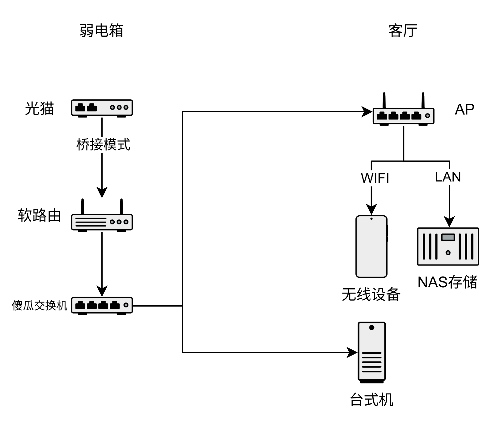
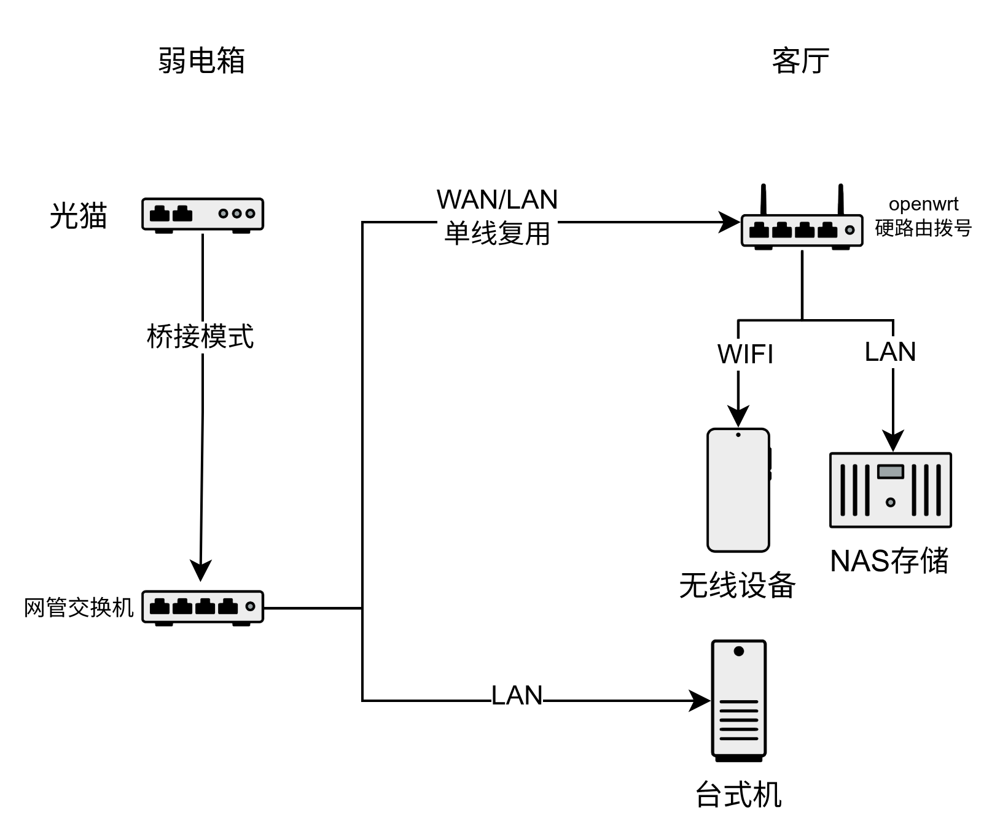
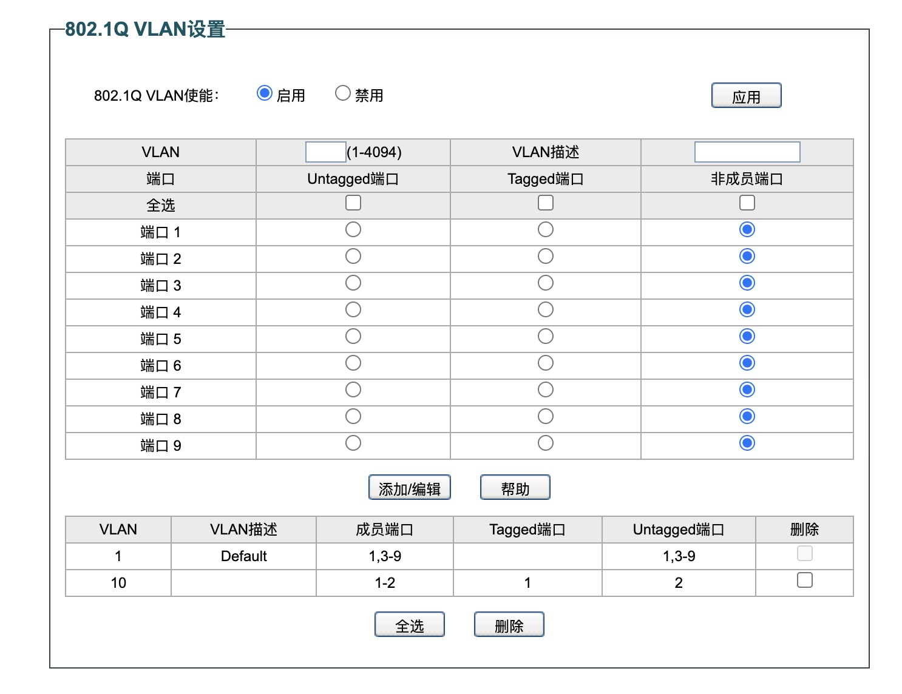
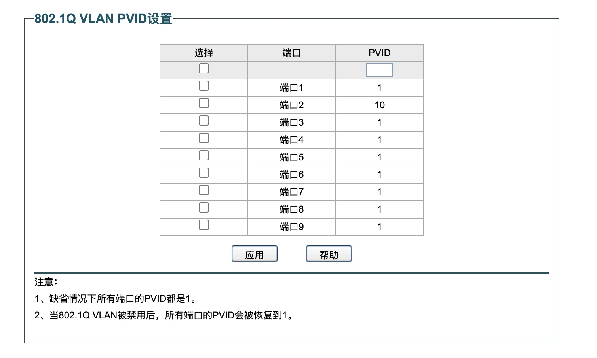
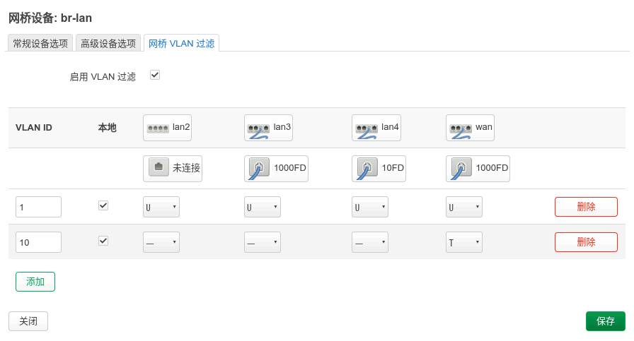

因为房子的大小布局不同，个人的要求不同，家庭网络的设备布局一直没有完美的方案。
而且很多人的网络知识不够，导致最终家庭网络称不上好用。如果有一定的网络知识，vlan是简化家庭网络的利器。
<!--more-->

## 概况
先说下原先的网络布局，光猫桥接模式，软路由作为主路由拨号，客厅的无线路由器使用 ap 模式。
虽然能够满足使用效果，但是多了个软路由，弱电箱空间变拥挤了，而且软路由发热也大，网络拓扑也复杂了。
原先是光猫拨号的，虽然能少个设备，但光猫的功能很弱，也不方便调整网络设置（如 DHCP, ipv6）。
也想过将无线路由器直接放弱电箱，又影响信号。总之当前的方案能满足需求，但不够完美。

现在，将傻瓜交换机换成网管交换机后，交换机只通过一条线连接客厅的的路由器。
在路由器拨号后，这条线又可以承载LAN网络，也就是WAN/LAN单线复用。
路由器的LAN口和交换机其他端口是一样的子网，也就是房子内所有网口的网络都是一致的，插上就能用。

用到的设备
- 网管交换机：水星 SE109 Pro
- 无线路由器：小米 AX3000T v1 （immortalwrt 24.10）

这里的设备没有硬性要求，只要支持 802.1Q VLAN 的交换机和路由器就行了。
如果不想用 immortalwrt/openwrt 等系统的路由器，也可以使用另一个网管交换机+普通路由器替代，但这样就背离初衷了。

## 交换机设置
我们需要使用 2 个 VLAN, VLAN1 用于 LAN 网络, VLAN10 用于 WAN 网络。
交换机共 9 个端口，先确定好每个端口的用途：1 连路由器，2 连光猫，3-9连普通设备。
打开交换机的 vlan 功能，依次设置 VLAN1 和 VLAN10 的端口成员和端口的 Tagged/Untagged 状态。
*我对 VLAN 原理其实也不是很熟悉，确保设置完和下图一致就行*

设置完 VLAN 端口后 PVID 应该会自动设置好，如果不是手动修改下。

所有设置完成后，记得 “保存设置”

## 路由器设置
**设置时最好先将路由器系统初始化，否则有可能保存失败。**

A. 网络  -> 接口 -> 设备 -> br-lan 网桥 -> 配置
1. 将 “交换机端口 wan”加入到网桥端口
2. 启用 VLAN 过滤
3. 添加 VLAN1, 勾选本地，并设置所有端口为 Untagged
4. 添加 VLAN10, 勾选本地，设置 WAN 为 Tagged, 其他为非成员
5. 保存，但是不要应用

B. 网络  -> 接口 -> lan -> 编辑
1. 将设备改为 “软件 VLAN： br-lan.1”
2. 保存不要应用

C. 网络  -> 接口 -> wan -> 编辑
1. 将设备改为 “软件 VLAN： br-lan.10”
2. 保存不要应用

D. 网络  -> 接口 -> wan6 -> 编辑
1. 将设备改为 “软件 VLAN： br-lan.10”
2. 保存不要应用

E. 保存并应用

**注意：**
1. 此次的设置和很多教程不同，因为我想要将路由器的 LAN 和 交换机普通端口联通
2. 如果是单口软路由设备，直接添加 VLAN（802.1q）的 VLAN10设备，应该也是可行的
3. openwrt 老版本（19以前）的设置和新版不同，不能作为参考

## VLAN 简单知识
- VLAN 就是虚拟局域网，也就是将某几个端口划分到某个虚拟局域网
- VLAN ID：虚拟局域网ID
- 非成员端口：该端口不属于某 VLAN, 不收不发，直接丢弃该 VLAN 的数据（隔离的关键）
- 成员端口：该端口属于某 VLAN，能收能发
- Access 口：普通端口，只属于某个 VLAN, 用于连接非交换机设备
- Trunk 口: 网络主干道，用于连接其他交换机设备,可以有多个 VLAN ID
- PVID：无 VLAN ID 的数据，从该端口进入交换机时附加的默认VLAN ID
- 一般 VLAN 成员端口的 PVID 等于 VLAN ID
- Trunk 端口的 PVID 绝对不等于它放行的所有 VLAN ID。Trunk 口的 PVID 通常保持默认的 1（Native VLAN）
- 交换机内部交换时不改变数据包的 VLAN ID
- Untagged：出端口数据去除ID
- Tageed：出端口数据保留ID

## 参考
- https://www.bilibili.com/video/BV1e34y1Q7bj/?spm_id_from=333.337.search-card.all.click&vd_source=638baf738d326f470fb0dd9f615c8d29
- https://blog.csdn.net/Cx2008Lxl/article/details/122990497